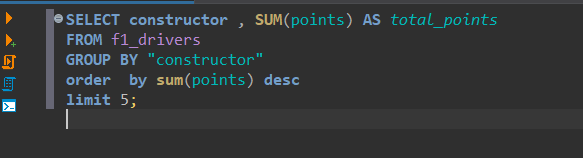

# ETL-Analyst_data_F1

## Objective
* Membuat service pipeline data dari file csv 
* Transformasi column data semulanya Capitalize menjadi lowercase
* Load data untuk dianalisa dalam bentuk SQL 

## workflow


## SQL query FIND most point in constructor
```
select  distinct  constructor, sum(points)
from f1_drivers 
group by constructor , points 
order by  sum(points) desc
```

## SQL query find Max points
```
select  driver_code, constructor, points 
from f1_drivers 
order by points  desc
```

## Result
* 
* 
